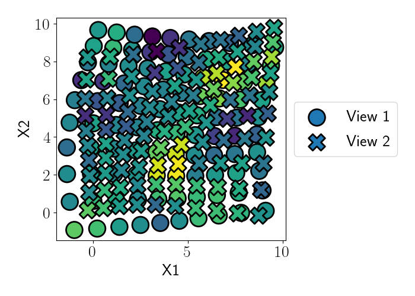

# Gaussian process spatial alignment (GPSA)


This repository contains the code for our paper, [Aligning spatial sequencing data using deep Gaussian processes]().

GPSA is a probabilistic model that aligns a set of spatial coordinates into a common coordinate system.

## Installation

The `gpsa` package is available on PyPI. To install it, run this command in the terminal:

```
pip install gpsa
```

The `gpsa` package is primarily written using [PyTorch](https://pytorch.org/). The full package dependencies can be found in `requirements.txt`.

## Usage

There are two primary classes that are used in GPSA: `GPSA` and `VariationalGPSA`. The class `GPSA` defines the central GPSA generative model, including the latent variables corresponding to the aligned coordinate system. The class `VariationalGPSA` inherits from the `GPSA` class and defines the variational approximating model and variational parameters.

## Example

Here, we show a simple example demonstrating GPSA's purpose and how to use it. To start, let's generate a synthetic dataset containing two views that have misaligned spatial coordinates. The full code for this example can be found in `examples/grid_example.py`.

We provide the synthetic dataset in the `examples/` folder. We can load it with the following code:

```python
import numpy as np
import anndata

data = anndata.read_h5ad("./examples/synthetic_data.h5ad")
```

Below, we plot the two-dimensional spatial coordinates of the data, colored by the value of one of the five output features. The first view is plotted with O's, and the second view is plotted with X's.



In this case, we expect the spatial coordinates to have a one-to-one correspondence between views (by construction), but we can see that the each view's spatial coordinates have been distorted.

We can now apply GPSA to try to correct for this distortion in spatial coordinates.

Now, let's format the data into the appropriate variables for the GPSA model. We need the spatial coordinates `X`, the output features `Y`, the indices of each view `view_idx`, and the number of samples in each view `n_samples_list`. We then format these into a dictionary.

```python
X = data.obsm["spatial"]
Y = data.X
view_idx = [np.where(data.obs.batch.values == ii)[0] for ii in range(2)]
n_samples_list = [len(x) for x in view_idx]

x = torch.from_numpy(X).float().clone()
y = torch.from_numpy(Y).float().clone()

data_dict = {
    "expression": {
        "spatial_coords": x,
        "outputs": y,
        "n_samples_list": n_samples_list,
    }
}
```

Now that we have the data loaded, we can instantiate the model and optimizer.

```python
import torch
import matplotlib.pyplot as plt
import seaborn as sns

from gpsa import VariationalGPSA
from gpsa import matern12_kernel, rbf_kernel
from gpsa.plotting import callback_twod

device = "cuda" if torch.cuda.is_available() else "cpu"

N_SPATIAL_DIMS = 2
N_VIEWS = 2
M_G = 50
M_X_PER_VIEW = 50
N_OUTPUTS = 5
FIXED_VIEW_IDX = 0
N_LATENT_GPS = {"expression": None}

N_EPOCHS = 3000
PRINT_EVERY = 100

model = VariationalGPSA(
    data_dict,
    n_spatial_dims=N_SPATIAL_DIMS,
    m_X_per_view=M_X_PER_VIEW,
    m_G=M_G,
    data_init=True,
    minmax_init=False,
    grid_init=False,
    n_latent_gps=N_LATENT_GPS,
    mean_function="identity_fixed",
    kernel_func_warp=rbf_kernel,
    kernel_func_data=rbf_kernel,
    fixed_view_idx=FIXED_VIEW_IDX,
).to(device)

view_idx, Ns, _, _ = model.create_view_idx_dict(data_dict)

optimizer = torch.optim.Adam(model.parameters(), lr=1e-2)
```

Finally, we set up our training look and begin fitting.

```python
def train(model, loss_fn, optimizer):
    model.train()

    # Forward pass
    G_means, G_samples, F_latent_samples, F_samples = model.forward(
        {"expression": x}, view_idx=view_idx, Ns=Ns, S=5
    )

    # Compute loss
    loss = loss_fn(data_dict, F_samples)

    # Compute gradients and take optimizer step
    optimizer.zero_grad()
    loss.backward()
    optimizer.step()

    return loss.item()

for t in range(N_EPOCHS):
    loss = train(model, model.loss_fn, optimizer)
print("Done!")
```

We can then extract the relevant parameters or latent variable estimates. Below, we show (in the right panel) an animation of the latent variables corresponding to the aligned coordinates over the course of training.


## Bugs

Please open an issue to report any bugs or problems with the code.
